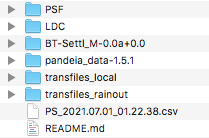

# JexoSim 2.0

</img>
 

  

JexoSim (JWST Exoplanet Observation Simulator) is a time-domain simulator for the James Webb Space Telescope, that simulates exoplanet transit observations using all four instruments.

Updates
------
Please check for the latest release.  A new release may be published if we have made changes to the code to manage any issues or if new functionalities have been added.

Installation
------
We recommend setting up a virtual environment  for JexoSim to avoid package conflicts.  The environment should install Python=3.8.5, matplotlib=3.3.1-0, setuptools=49.6.0, numpy=1.19.1, numba=0.50.1.  Using conda the following command line instruction will do all this for you:.

    conda create -n jexosim python=3.8.5 matplotlib=3.3.1-0 setuptools=49.6.0 numpy=1.19.1 numba=0.50.1

Then activate this environment. Depending on the system the activation command may be any one of the following:

    source activate jexosim
    
or    

    conda activate jexosim
    
or    
    
    activate jexosim

### GitHub

Next, clone the repository from github.

    git clone https://github.com/subisarkar/JexoSim.git

### Databases

Next, download the following databases.  

[Pandeia](https://stsci.app.box.com/v/pandeia-refdata-v1p5p1/) (Pontoppidan, K.M. et al., 2016, Proc. SPIE, 9910, 991016).  
This is used to obtain the instrument transmissions, QE and wavelength solutions.  Unzip this folder, then move the folder into the `JexoSim/archive/` folder already in the  `JexoSim` folder structure.  The final path will look like this:  `path_to_JexoSim/JexoSim/archive/pandeia_data-1.5.1`.   The version number (e.g. 1.5.1) of the folder may change, but the code will still recognise the folder. 

[Phoenix BT-Settl database](https://phoenix.ens-lyon.fr/Grids/BT-Settl/CIFIST2011_2015/FITS/BT-Settl_M-0.0a+0.0.tar) (Allard F., Homeier D., Freytag B., 2012, Philos. Trans. Royal Soc. A, 370, 2765).  
These are the stellar spectrum models.  Unzip the folder to give the folder labelled `BT-Settl_M-0.0a+0.0`.  (There is no need to unzip the enclosed fits files.)  Then moved the folder into  `JexoSim/archive/` to give the final path `path_to_JexoSim/JexoSim/archive/BT-Settl_M-0.0a+0.0`.

[ATMO foward model grid (local)](https://drive.google.com/file/d/1Kvfi7FTBqM1MfnkTnHsJJqI7EFwnuaIG/view?usp=sharing) (Goyal, J. et al., 2018, MNRAS, 482, 4503)    
[ATMO foward model grid (rainout)](https://drive.google.com/file/d/1LnpL_kpbZGPEN0G6QhHrL4DcD4hwvaia/view?usp=sharing) (Goyal, J. et al., 2018, MNRAS, 482, 4503)  
These downloads are optional.  JexoSim will still be able to function without these files, but to use the ATMO grid to obtain an input planet spectrum, you must download these folders.  Unzip both these folders and move them into the `JexoSim/archive/`.  The final paths will be  `path_to_JexoSim/JexoSim/archive/transfiles_local` and  `path_to_JexoSim/JexoSim/archive/transfiles_rainout`.  

[PSF](https://drive.google.com/file/d/1YFbB02IR9U-9J6UDw8SsdBo5aKh0V-_6/view?usp=sharing)  
[LDC](https://drive.google.com/file/d/1lWRdqW_wI3y31ugqq2HfyyekGyOSteL_/view?usp=sharing)  
These contain pre-calculated point spread functions obtained using WebbPSF (Perrin. M. et al., 2014, Proc. SPIE. 9143, 91433X) and limb darkening coefficients obtained using ExoTETHyS (Morello, G. et al. (2020). AJ, 159,  75).  Unzip the folders and move them into `JexoSim/archive/`.  The final paths will be `path_to_JexoSim/JexoSim/archive/PSF` and `path_to_JexoSim/JexoSim/archive/LDC`  

From the [NASA Exoplanet Archive](https://exoplanetarchive.ipac.caltech.edu/cgi-bin/TblView/nph-tblView?app=ExoTbls&config=PS&constraint=default_flag=1), download the 'Planetary Systems' table as follows: under 'Download Table' choose 'CSV format', 'Download all columns', 'Download all rows', and then hit 'Download Table'.  Move the .csv file into the `JexoSim/archive/` folder. The final path to the file will be  `path_to_JexoSim/JexoSim/archive/PS_xxxxxxxxxxx.csv`, where the exact name of the .csv file will vary based on the download date and time.  No need to rename the file however, as the code will recognise the file.

The final contents of the `JexoSim/archive/`  folder should look something like this:

</img>
 

  

If you use any of the above databases in your research, please credit the above authors.

### Set up
Next navigate to inside the `JexoSim` folder and run `setup.py`, followed by  `generate.py`.  This will setup the remaining package dependencies for JexoSim, extract transmission files and generate wavelength solutions from the Pandeia database, producing JexoSim-compatible files, and generate a PRNU grid.

    cd JexoSim
    python setup.py install
    python generate.py
    
    
### Output folder
By default JexoSim will place the results from the simulations into the `JexoSim/output/` folder. However you may choose a different location to store these results.  To do so find the file `jexosim_paths.txt` in the `JexoSim/jexosim/input_files/` folder, and next to `output_directory` (leaving at least one white space gap),  enter the full path to the location including folder name, e.g. `/Users/UserA/Desktop/JexoSim_Results`.  The folder will be automatically generated. If this is blank, the default location will be chosen.

Running a simulation
------
Navigate to inside the `JexoSim` folder, and run the `run_jexosim.py` file with an input parameter file (e.g. `jexosim_input_params_ex1.txt`) as the argument.  Some example input parameter files are provided (see below).

      cd JexoSim
      python run_jexosim.py jexosim_input_params_ex1.txt
      
Alternately if using an IDE (e.g. Spyder), you can open the file `JexoSim/jexosim/run_files/run_jexosim.py` and run from within the environment using the parameter file name (e.g. `jexosim_input_params_ex1.txt`) as the argument for the function `run`.  Results will be packaged as a .pickle file in the designated output folder.  The code will also display results once completed.

Results
------
The results from any given simulation are placed in the output folder.  To identify the simulation, the file name includes the type of simulation, the planet, instrument channel and end time of the simulation.  A file with the suffix 'TEMP' is a temporary file for an ongoing multi-realisation simulation, but can be accessed in the same way as a completed simulation file.  The data is in the form of a dictionary.   To display results from a results file (e.g. `Noise_budget_MIRI_LRS_slitless_GJ 1214 b_2021_08_19_2147_43.pickle`):

    cd JexoSim
    python results.py Noise_budget_MIRI_LRS_slitless_GJ 1214 b_2021_08_19_2147_43.pickle

Make sure the file is in the designated output directory for this to work.
In addition a .txt with the same name as the dictionary file will be generated containing derived simulation values (e.g. number of NDRs, integration time etc.) and the input parameter file values used.

FITS output file only
------

### 1.  No processing

You can choose to not run the JexoSim pipeline but simply store the unprocessed JexoSim image time series in FITS format. This will allow you to run the synthetic data through an alternate pipeline.  This option is available for both OOT and full transit simulations, however it is not available for noise budget simulations.  To choose this option, enter `2`  for the entry `sim_output_type` in the input parameter file.  The FITS file will appear in the output folder together with a .txt file containing simulation information.

### 2.  Intermediate processing

You can allow JexoSim to process the raw data through stage 1 of its pipeline, producing calibrated light curves binned to the desired R-power or number of pixel columns.   These are then packaged into FITS format and dumped in the output folder together with a .txt file containing simulation information.  This option is available for both OOT and full transit simulations, however it is not available for noise budget simulations.   To choose this option, enter `3`  for the entry `sim_output_type` in the input parameter file. 

Examples
------
5 example input parameter files are provided.  These can be duplicated and edited as required by the user.  For further information on running these example go to :  [Tutorial](docs/Tutorial.md)

Use of code
------

JexoSim does not contain all known systematics for the various instruments, but is a good starting point to investigate the effects of systematics, and has the framework to incorporate more systematics in the future.  
 
Citing
------

If you use JexoSim in your research, please cite:

Sarkar, S., Madhusudhan, N. (2021).  JexoSim 2.0: end-to-end JWST simulator for exoplanet spectroscopy – implementation and case studies.  Monthly Notices of the Royal Astronomical Society, 508(1), 433–452.
