# JexoSim 2.0

</img>
 

  

# JexoSim 2.0 tutorial
 
 Four example files are provided corresponding to the case studies given in Sarkar & Madhusudhan (2021) JexoSim 2.0: End-to-end JWST Simulator for Exoplanet Spectroscopy - Implementation and Case Studies (submitted).

Example 1 : OOT simulation with Allan deviation analysis (NIRISS)
------
Navigate to inside the `JexoSim` folder. 

      cd JexoSim
      
Enter the following.
      
      python run_jexosim.py jexosim_input_params_ex1.txt
      
Alternately if using an IDE (e.g. Spyder), you can open the file `JexoSim/jexosim/run_files/run_jexosim.py` and run from within the environment using the parameter file name (e.g. `jexosim_input_params_ex1.txt`) as the argument for the function `run`.  

This example will run an out-of-transit simulation, followed by Allan deviation analysis.  It will automatically run  `results.py` to display the final results.  The results can also be displayed by entering the following:
 
    python results.py xxxx.pickle

where  `xxxx.pickle`  is the output file name in the output directory.  The results will show the signal, noise, fractional noise at T14, and the predicted noise on the transit depth.

The example file is set up to run NIRISS with K2-18 b as the target.  You should get results similar to those shown below.  In order (left to right): example integration image, example spectrum (1 transit), precision on transit depth vs wavelength, fractional noise at T14 vs wavelength, noise (standard deviation of signal), noiseless signal.

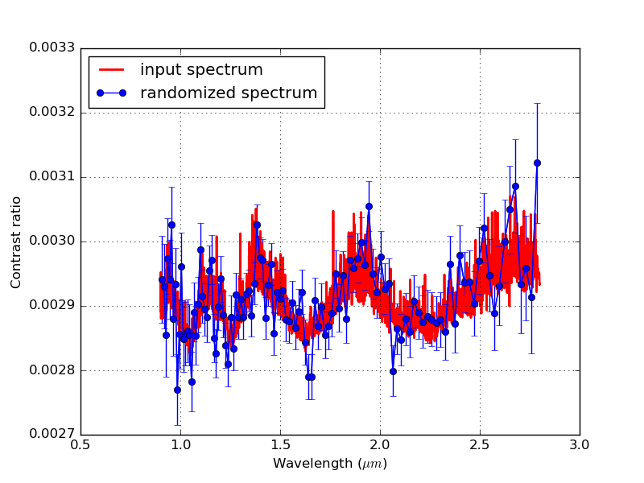
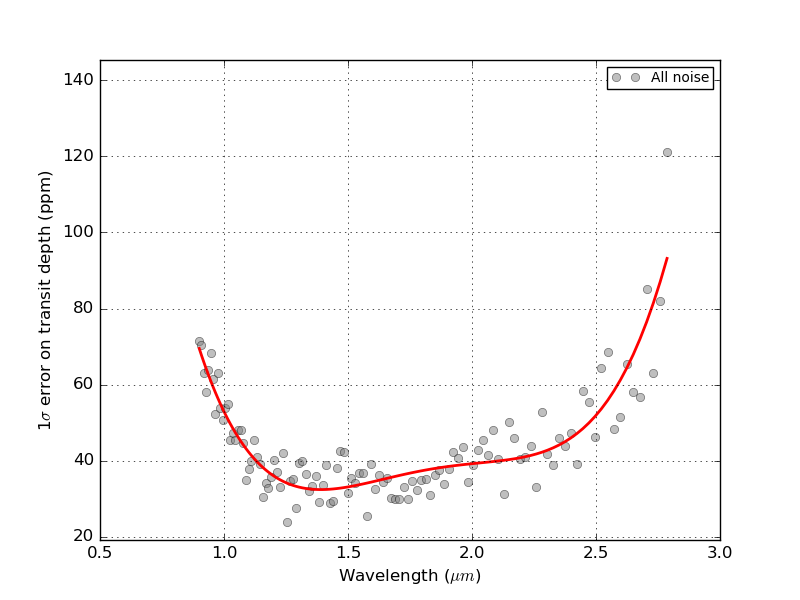
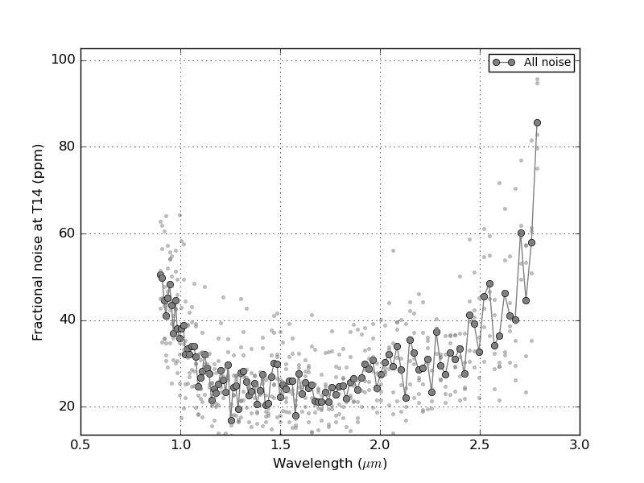
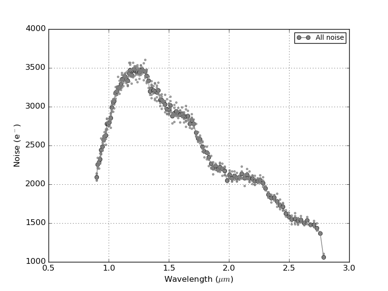
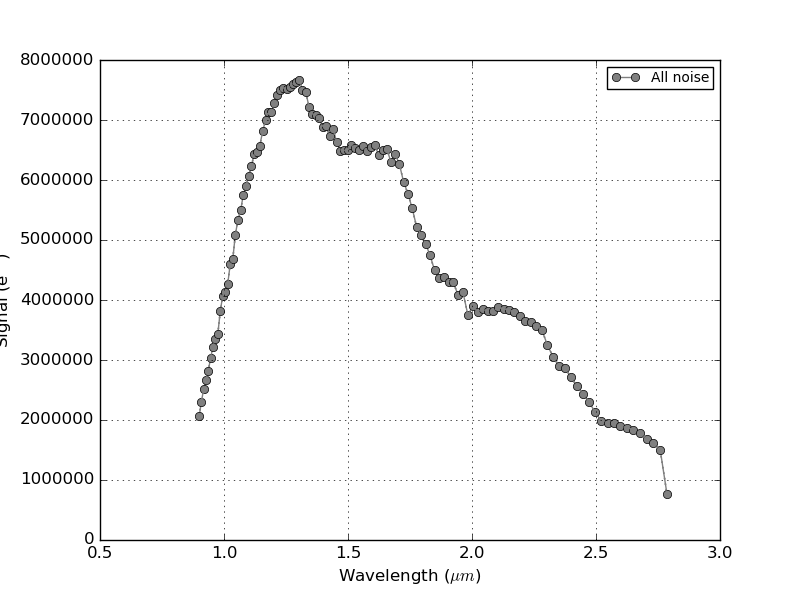
</img>
 

  

Example 2 : Full transit simulation with Monte Carlo method (NIRCam)
------
Navigate to inside the `JexoSim` folder. 

      cd JexoSim

Enter the following.

      python run_jexosim.py jexosim_input_params_ex2.txt

Alternately if using an IDE (e.g. Spyder), you can open the file `JexoSim/jexosim/run_files/run_jexosim.py` and run from within the environment using the parameter file name (e.g. `jexosim_input_params_ex2.txt`) as the argument for the function `run`.  

This example will run a Monte Carlo full transit simulation with 50 realizations.  It will automatically run  `results.py` to display the final results.  The results can also be displayed by entering the following:

    python results.py xxxx.pickle

where  `xxxx.pickle`  is the output file name in the output directory.  The results will show the the predicted noise on the transit depth and spectra with error bars.

The example file is set up to run NIRCam F322W2 with K2-18 b as the target.  You should get results similar to those shown below.  In order (left to right): example integration image, example spectrum (1 transit), precision on transit depth vs wavelength, mean transit depth and distribution from the Monte Carlo.  
 
 

 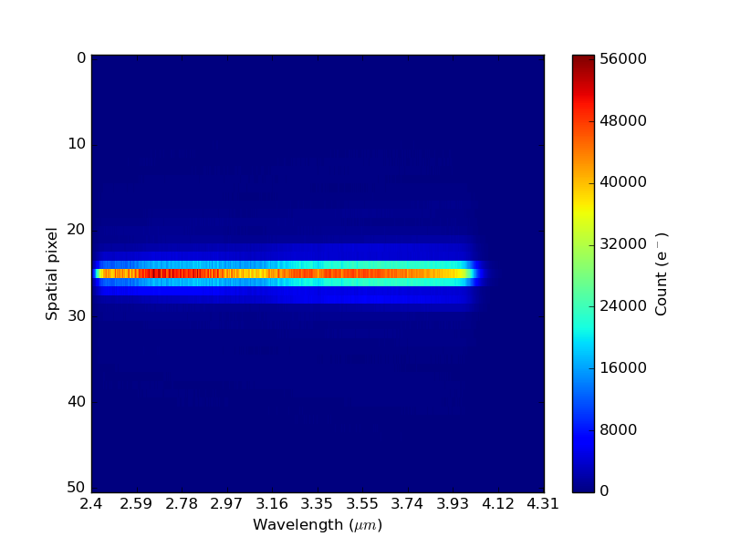
 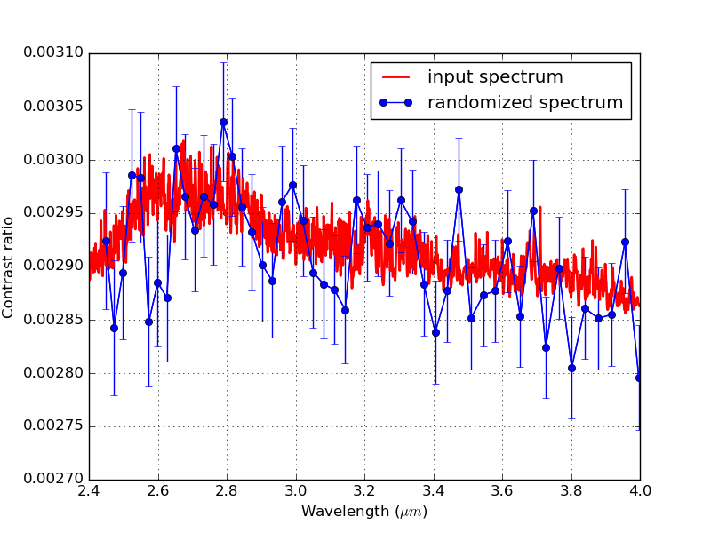
 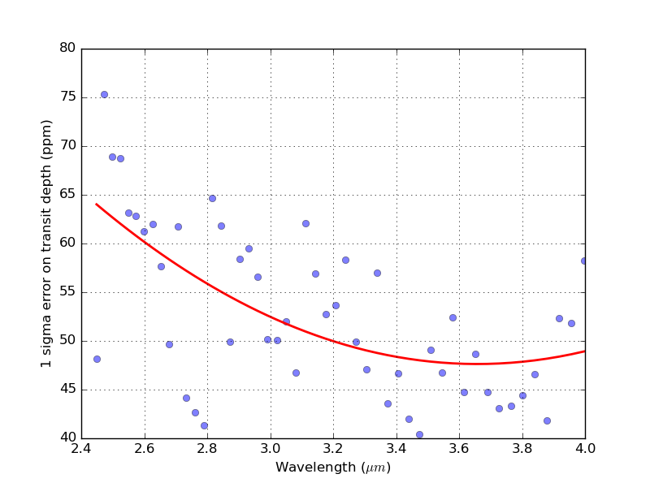
 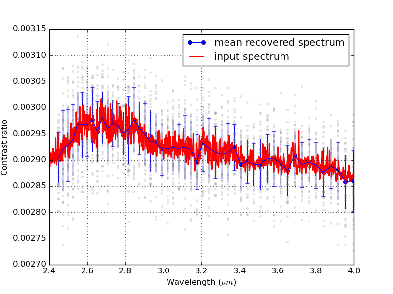

 </img>
  
 

   

You can change the `obs_inst_config` factor in the input parameters to other NIRCam configurations, or use MIRI LRS.  

Example 3 : Full transit simulation with Monte Carlo method (NIRSpec)
------
Navigate to inside the `JexoSim` folder. 

      cd JexoSim

Enter the following.

      python run_jexosim.py jexosim_input_params_ex3.txt

Alternately if using an IDE (e.g. Spyder), you can open the file `JexoSim/jexosim/run_files/run_jexosim.py` and run from within the environment using the parameter file name (e.g. `jexosim_input_params_ex3.txt`) as the argument for the function `run`.  

This example will run a Monte Carlo full transit simulation with 50 realizations.  It will automatically run  `results.py` to display the final results.  The results can also be displayed by entering the following:

    python results.py xxxx.pickle

where  `xxxx.pickle`  is the output file name in the output directory.  The results will show the the predicted noise on the transit depth and spectra with error bars.

The example file is set up to run NIRSpec G140M F100LP with the SUB2048 subarray, with K2-18 b as the target.  You should get results similar to those shown below.  In order (left to right): example integration image, example spectrum (1 transit), precision on transit depth vs wavelength, mean transit depth and distribution from the Monte Carlo.  

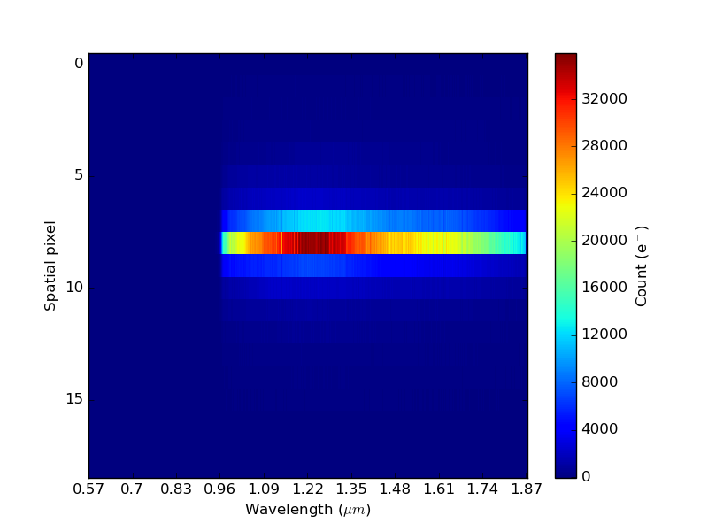
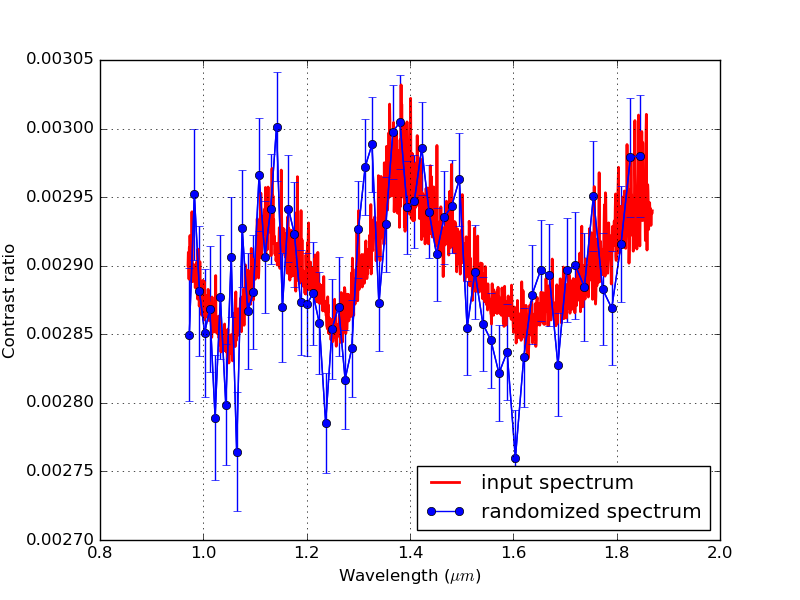
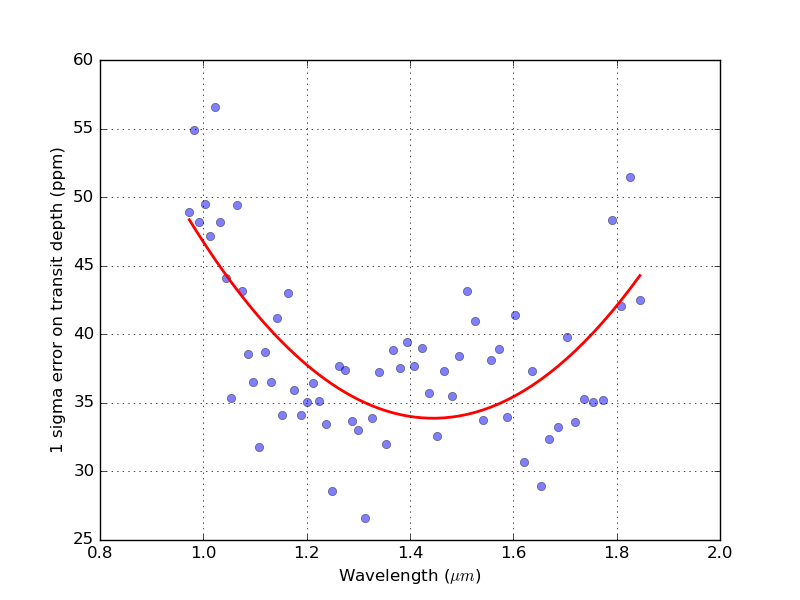
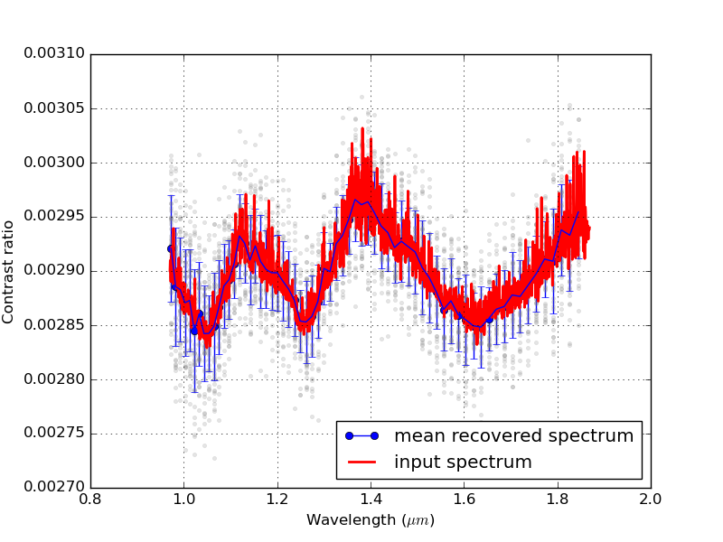

</img>
 

  

You can change the `obs_inst_config` factor in the input parameters to other NIRSpec configurations using medium or high resolution gratings, different subarray modes, or prism mode.   The target can be changed to HD 209458 b by changing the `planet_name` in the input parameters file from `K2-18 b` to `HD 209458 b`.

Example 4 : Noise budget analysis (MIRI)
------
Navigate to inside the `JexoSim` folder. 

      cd JexoSim

Enter the following.

    python run_jexosim.py jexosim_input_params_ex4.txt

Alternately if using an IDE (e.g. Spyder), you can open the file `JexoSim/jexosim/run_files/run_jexosim.py` and run from within the environment using the parameter file name (e.g. `jexosim_input_params_ex3.txt`) as the argument for the function `run`.  

This example will run an out of transit simulation, cycling over all noise sources.  It will automatically run  `results.py` to display the final results.  The results can also be displayed by entering the following:

python results.py xxxx.pickle

where  `xxxx.pickle`  is the output file name in the output directory.  The results will show the the signal and noise per spectral bin, per noise source.

The example file is set up to run MIRI LRS  with K2-18 b as the target.  You should get results similar to those shown below.  In order (left to right): example integration image,  fractional noise at T14 vs wavelength, noise (standard deviation of signal), noiseless signal.

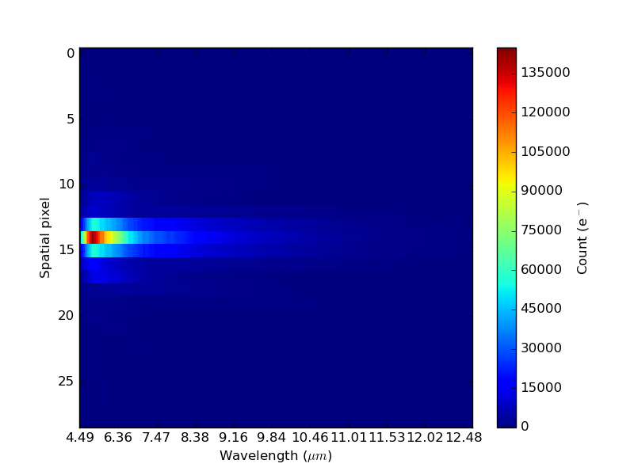

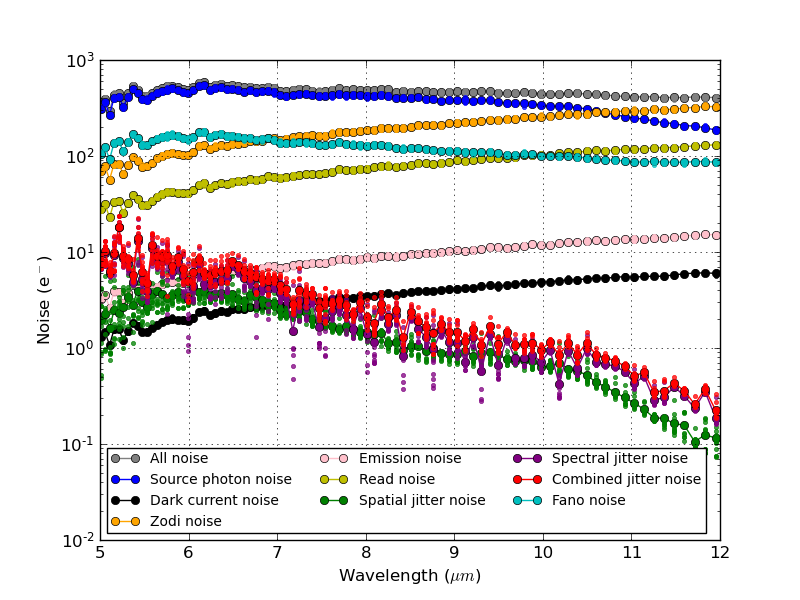
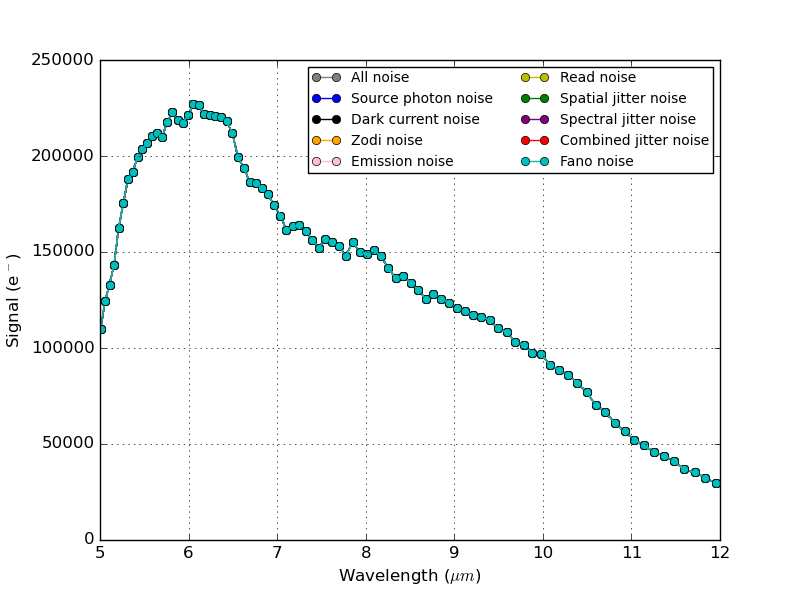

</img>
 

  

